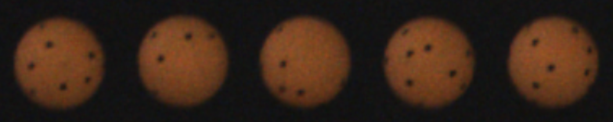

# SpinDOE: A ball spin estimation method for table tennis robot



This repository contains the code for SpinDOE, a table tennis ball spin estimation algorithm. The algorithm is described in the paper [Gossard et al.](https://arxiv.org/abs/2303.03879).

## Use
Images are to be saved with their timestamps in microseconds as their name: "897987340.png"

```python
python spindoe.py
```


## Citation
If you find this project useful for your research, please use the following BibTeX entry.

```bibtex
@misc{gossard2023spindoe,
      title={SpinDOE: A ball spin estimation method for table tennis robot}, 
      author={Thomas Gossard and Jonas Tebbe and Andreas Ziegler and Andreas Zell},
      year={2023},
      eprint={2303.03879},
      archivePrefix={arXiv},
      primaryClass={cs.CV}
}
```
