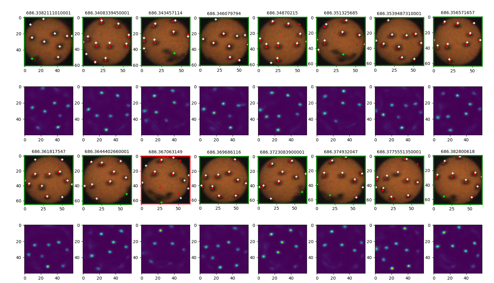
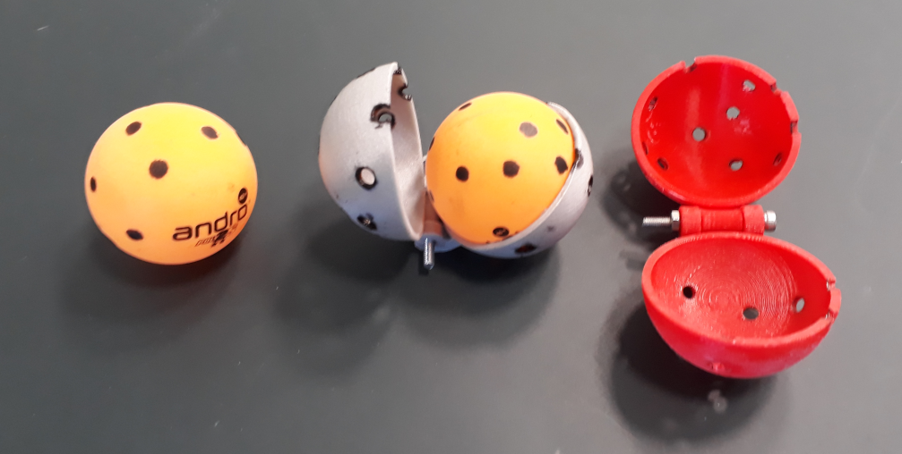
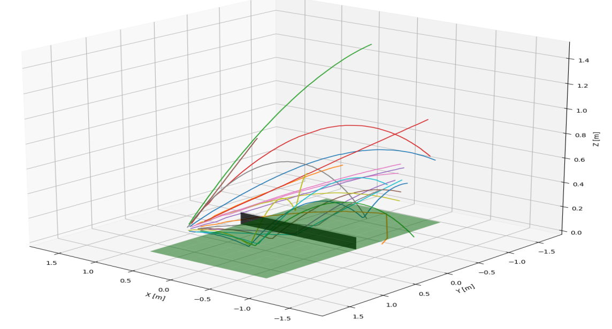

# SpinDOE: A ball spin estimation method for table tennis robot


This repository contains the code for SpinDOE, a table tennis ball spin estimation algorithm. The algorithm is described in the paper [Gossard et al.](https://arxiv.org/abs/2303.03879).

## Use
Images are to be saved with their timestamps in nanoseconds as their name: "686338211101.png"

```python
python spindoe.py
```

You should obtain the following output from running the script:



The red dots are the predicted dot positions and the green dot is the predicted logo position using DOE and the white dots are the predicted dot positions using the estimated spin value and the first valid orientation.

## Ball stencil
To accurately, easily and in a repeatable manner draw the dot on the table tennis balls, a 3D printed stencil is available in the cad/ directory. 
A screw is used for the hinge.

All the information and CAD models to reproduce the stencil are available [here](./cad). 



## Trajectory dataset
Using SpinDOE, we generated a dataset of table tennis ball trajectories with an accurate spin measurement.

The dataset is available [here](./data/trajectories).


## Citation
If you find this project useful for your research, please use the following BibTeX entry.

```bibtex
@misc{gossard2023spindoe,
      title={SpinDOE: A ball spin estimation method for table tennis robot}, 
      author={Thomas Gossard and Jonas Tebbe and Andreas Ziegler and Andreas Zell},
      year={2023},
      eprint={2303.03879},
      archivePrefix={arXiv},
      primaryClass={cs.CV}
}
```
