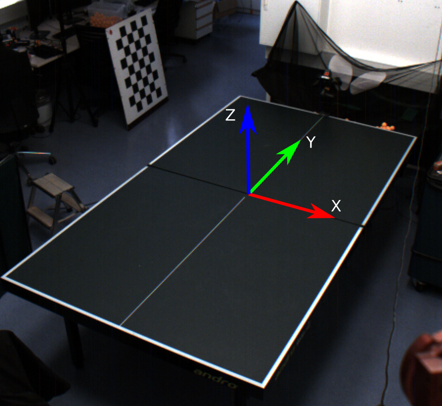

# Table tennis ball trajectory dataset 


An example of a script to read the dataset is available:

```python
python read_trajectory.py  [index of the trajectory to read]
```


## Format
The frame used to describe the trajectory is shown in the following picture. The unit used is meters for the position and rad/s for the spin. The spin is represented as a vector.

 


All the spins are saved in the index.csv file and refer to the corresponding trajectory in another numbered csv file.           
